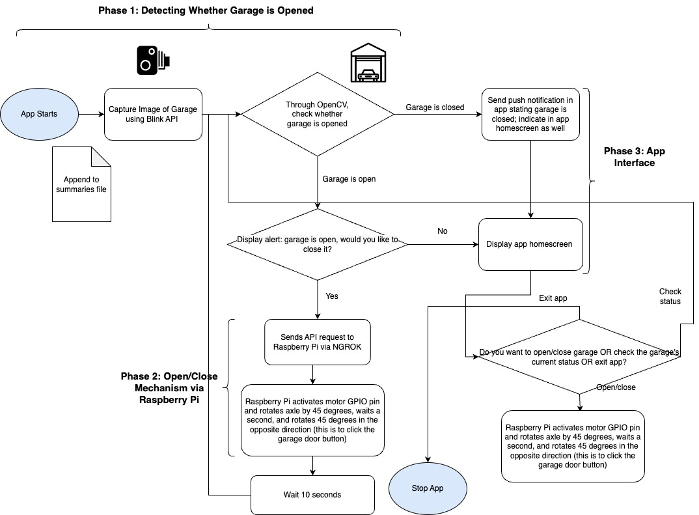

# Garage Door IoT (WORK IN PROGRESS)

During the morning rush to work or school, it is easy to forget one thing: closing the garage. "Is the garage door closed?," someone in the car asks almost while we're miles away from home, too far away to do anything. To solve this problem, I'm devising a system that can close and open our garage door remotely through an iOS app interface.

## Application Architecture



I've split my project up into three phases: Phase 1, which involves detecting the state of the garage door (open or close) and Phase 2, which involves creating the mechanism for opening and closing the garage door, and Phase 3: developing a simple iOS app to package this functionality.

For Phase 1, I used the [blinkpy](https://github.com/fronzbot/blinkpy) to capture images from the Amazon Blink camera positioned inside our garage. To forgo multifactor authentication \(MFA wouldn't be viable given that the checking program needs to run without interruption\), I used the python Auth library, which remembers credentials from session to session. I then passed this image into the opencv library, where I used a Floodfill algorithm to detect whether the garage door is open or not based on the retval (higher retval = open). Unfortunately, this algorithm relies on differentiating pixel colors, which makes detecting whether the garage is open or not difficult when the light inside the garage is off.

For Phase 2 \(opening and closing the garage\), I am linking the application to a Raspberry Pi that has a motor attached to it. I mounted a motor control board to the Pi and connected the motor to the motor control board via GPIO. Additionally, I will 3D print a part that can "push" the button to open the garage door (design of part TBD). The button is pushed (which can either open or close the garage) when the Raspberry Pi receives an API request, probably through an NGROK endpoint.

Phase 3 of the project — developing the app — ties all of these parts together into a cohesive, iOS user interface. Each time the app is opened, it automatically checks the status of the garage door and, if it is open for more than ten minutes, displays an alert prompting them to close the garage door. Even if the app is not open, a push notification is sent to the user when the garage door is open. Furthermore, a thumbnail of the latest image of the garage, as well as a button to open and close the garage, are a part of the app's simple home screen.

## Materials Used

- Amazon Blink Camera
- Raspberry Pi
- Motor for Raspberry Pi
- Motor Controller Board
- 3D print of gear attached to motor to hit button
- 3D print of a case accommodating Raspberry Pi and Motor

## Steps for Installating Software

To take a picture from a Blink camera and detect whether it represents an opened or closed garage door, we need to install the blinkpy and OpenCV libraries:

```bash
pip install blinkpy
pip install opencv-python
```

Furthermore, to host an API on the Raspberry Pi, you must install ngrok and flask:

```bash
pip install ngrok
pip install flask
```

Create a dotenv file, and change the environment variables to contain your Blink account username and password.

```bash
BLINK_USERNAME="<USERNAME>"
BLINK_PASSWORD="<PASSWORD>"
```

Note: to adapt this code for your personal use, tweaking, especially of the OpenCV part of the algorithm, might be necessary.

## Tasks to complete

- [ ] Update garage door detection algorithm for better accuracy in darker environments; the opencv floodfill algorithm only works when there is a pixel variation
- [ ] 3D print necessary parts for mounting Raspberry Pi next to garage door button
- [ ] Create Figma wireframes and Xcode Storyboards for iOS App
- [ ] Code iOS app
